# Important-Notes

## Thickness Measurements Spreadsheet

[Thickness Measurements - Google Sheets](https://docs.google.com/spreadsheets/d/1Z0l37UuiWtCGDDQdLca21TNhlsUNsffI3soyZyvM7jc/edit#gid=0)

## X-Ray Continium Measurements

The below measurements were taken with the PROTO source with a Ti anode set at 25keV and 2.0mA

### "50 um" Al filter measurment for Tim (7/20)

Nominal thickness: $50 \mathrm{\mu m}$ Al

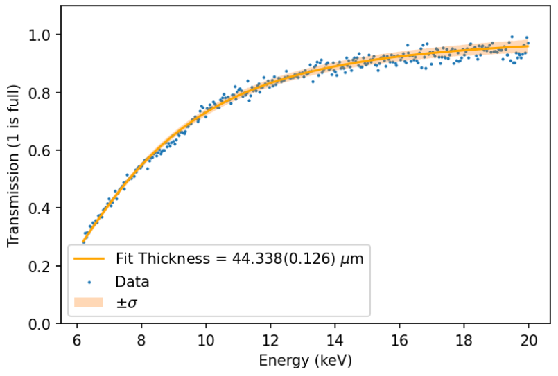

### "SRF2" measurements for Tim (7/28)

Window 1 nominal thickness: $10 \mathrm{\mu m}$ Ta

Window 2 nominal thickness: $15 \mathrm{\mu m}$ Ta

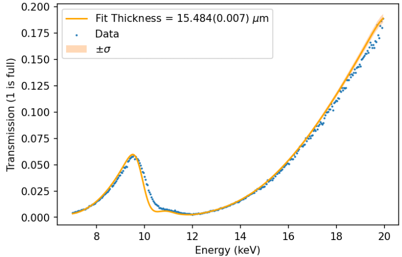

Window 3 nominal thickness: $20 \mathrm{\mu m}$ Ta

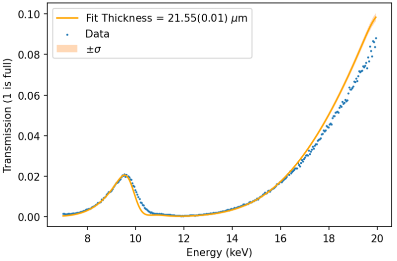

### "50um" Polypropylene for PIXE window (7/31)

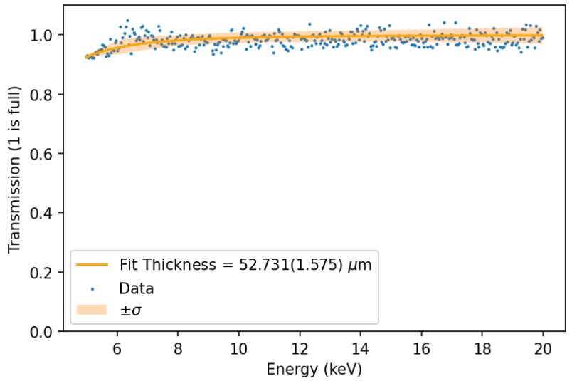

### "50um" polypropylene with steel mesh for PIXE window (7/31)

No thickness measurement reported because fitting to a steel mesh is difficult. But this shows the transmission data for our PIXE window

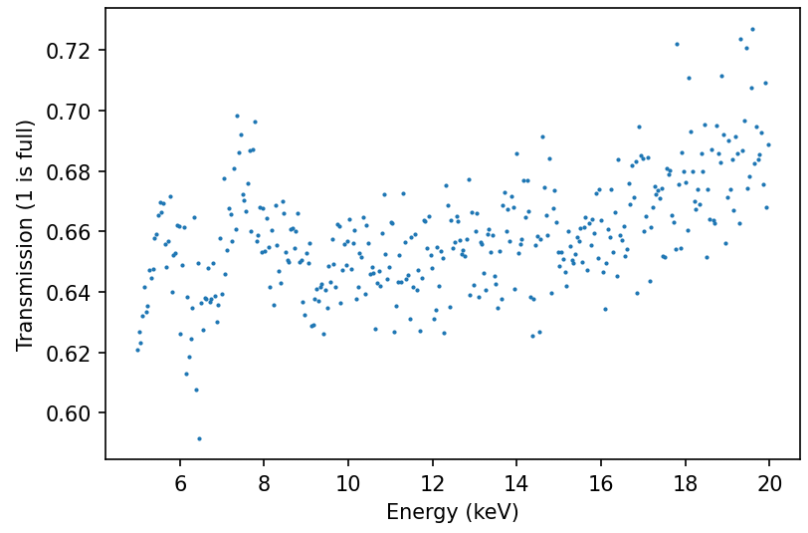

### Known Al puck measurements

Nominal thickness is $6.8 \mathrm{mg/cm^2}$ or $11.1 \mathrm{\mu m}$ Al (puck #2) (8/2)

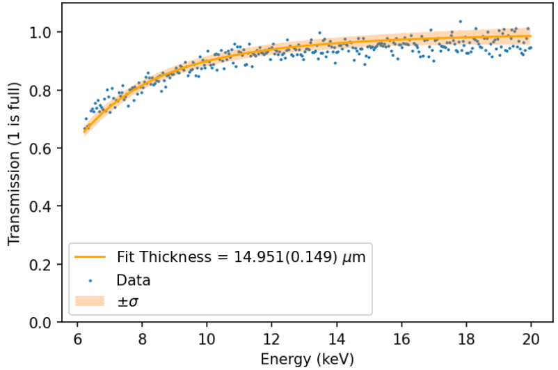

Nominal thickness is $81.2 \mathrm{mg/cm^2}$ or $300.7 \mathrm{\mu m}$ Al (puck #7) (8/7)

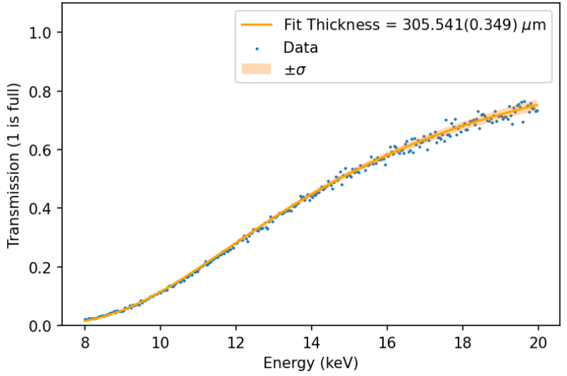

## Copper $K_\alpha/K_\beta$ line measurements

The below measurements were taken with the PROTO x-ray source using the Cu anode set at 12 keV and 2.0 mA with a 38 um copper filter

### Known Al puck measurements

Nominal thickness is $6.8 \mathrm{mg/cm^2}$ or $11.1 \mathrm{\mu m}$ Al (puck #2) (8/7)

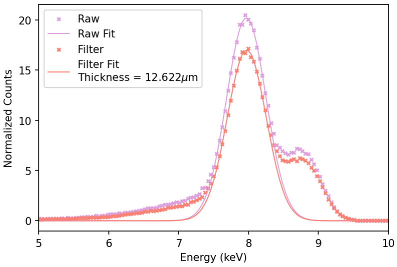

Nominal thickness is $13.7 \mathrm{mg/cm^2}$ or $50.74 \mathrm{\mu m}$ Al (puck #4) (8/7)

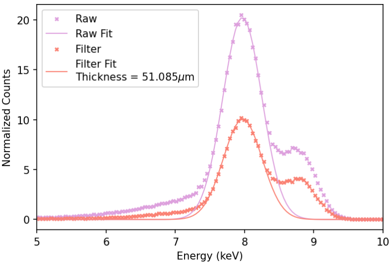

#### Nominal thickness is $20.3 \mathrm{mg/cm^2}$ or $75.19 \mathrm{\mu m}$ Al (puck #5) (8/9)

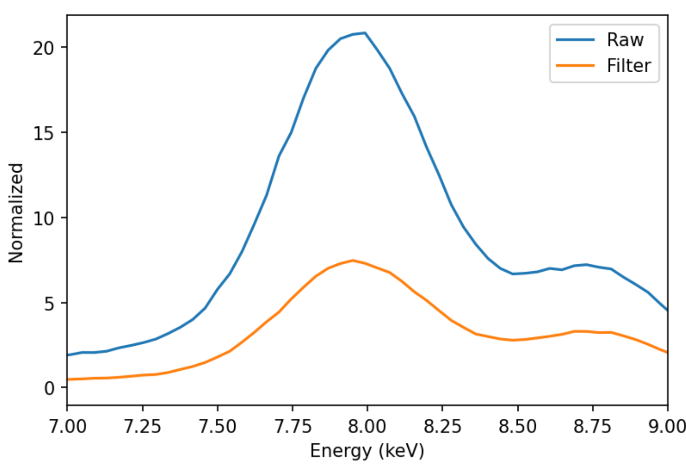

Without a gaussian blurring

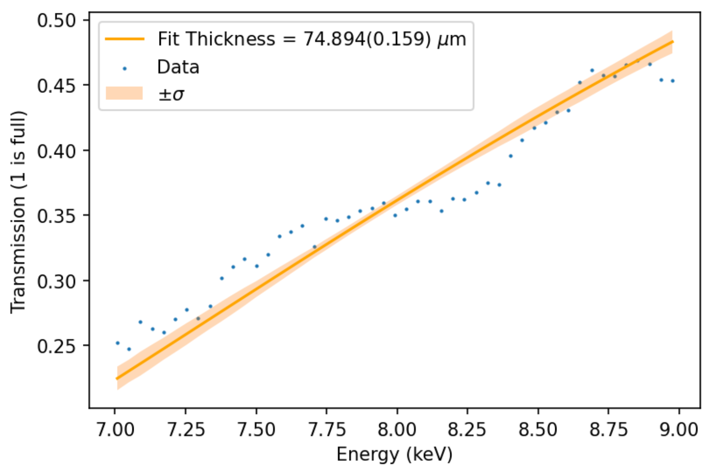

With a gaussian blurring

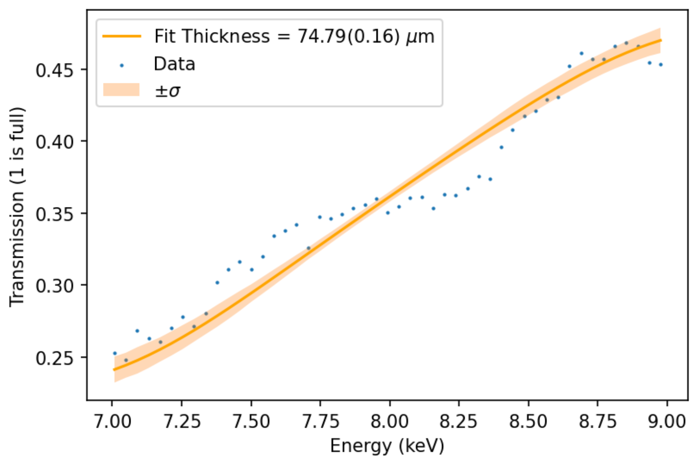
